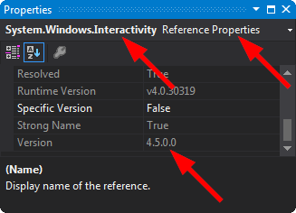

# SmartFreezer

# New Module Development

### Add reference to System.Windows.Interactivity.dll

Sometimes, when you add a new library, in introduces a clashing version of **System.Windows.Interactivity.dll**. For example, the NuGet package MVVM light might require v4.2 of System.Windows.Interactivity.dll, but the NuGet package Rx-XAML might require v4.5 of System.Windows.Interactivity.dll. This will prevent the the project from working, because no matter which version of System.Windows.Interactivity.dll you include, one of the libraries will refuse to compile.

To fix, add an Assembly Binding Redirect by editing your app.config to look something like this:

```csharp
<?xml version="1.0"?>
<configuration>
<runtime>
  <assemblyBinding xmlns="urn:schemas-microsoft-com:asm.v1">
    <dependentAssembly>
      <assemblyIdentity name="System.Windows.Interactivity"
                        publicKeyToken="31bf3856ad364e35"
                        culture="neutral"/>
      <bindingRedirect oldVersion="4.0.0.0"
                       newVersion="4.5.0.0" />
    </dependentAssembly>
  </assemblyBinding>
</runtime>
<startup><supportedRuntime version="v4.0" sku=".NETFramework,Version=v4.5"/></startup>
<appSettings>
  <add key="TestKey" value="true"/>
</appSettings>
```

Don't worry about changing the **PublicKeyToken**, that's constant across all versions, as it depends on the name of the **.dll**, not the version.

Ensure that you match the **newVersion** in your **App.config** to the actual version that you end up pointing at:



**NOTE**: you can find the DLL in the following folder:

```
C:\Program Files (x86)\Microsoft SDKs\Expression\Blend\.NETFramework\v4.5\Libraries
```
